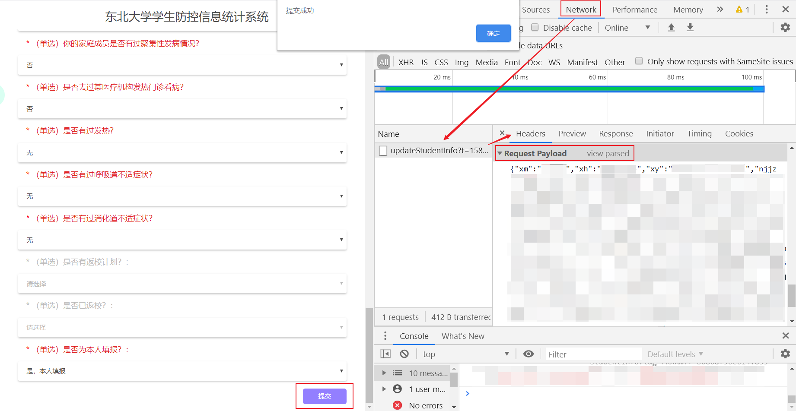

# NEU AutoSign

本项目是为了自动完成NEUer们每日头疼的“云成长大数据一体化平台”签到。

只需把配置信息填写好，就可以把它部署在你的服务器上运行了

自启可以使用Linux自带的crontab设置计划任务，记得检查服务器时区。

依赖环境：Python3，requests库

**使用协议：此项目只为健康、目前居住地无变动、未接触高风险源、目前不处于医疗观察阶段的同学提供服务**
**若您的身体抱恙或生活情况变动，请立即停用此项目，并遵守学校规定登陆网站上报目前情况。学校服务器会保存最新的提交。**
**免责声明：本项目不对使用者的任何行为负责，使用脚本的全部风险由且仅由您本人承担。**
**任何下载、拷贝、甚至借鉴此项目的行为即视为同意本许可协议**

下面开始配置脚本。

首先填写脚本login_payload变量中的username和password项（8和10行），就是你登录stuinfo时所使用的用户名和密码。

接下来以chrome为例，请根据自己使用的浏览器酌情调整。

请最后一次登录你的统计系统，打开网页后按F12进入开发者模式。点击提交，但不要点“提交成功”msgbox的确认按钮。在调试页面中Network选项卡下找到updateStudent开头的请求，双击，在Headers中找到Request Payload，以View Source模式查看提交信息原始形式。

把大括号内所有内容复制到脚本13行post_data中即可。

进一步地，你可以去[Server酱](https://sc.ftqq.com/)那里配置你的自动签到后微信推送——每天早上服务器自动签到之后会向你问好。
**非常建议配置微信推送。表格更新时程序将无法完成自动签到，会提醒您手动提交新表格并更新post_data**

Have fun！
